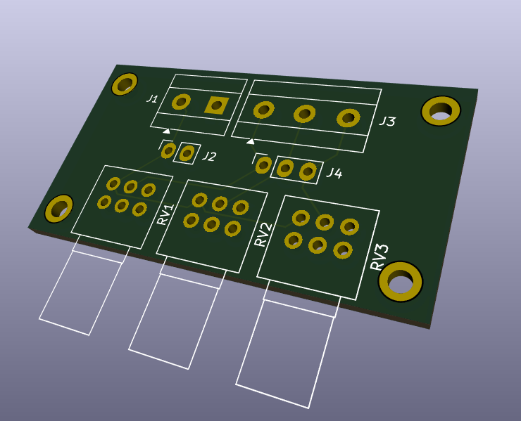
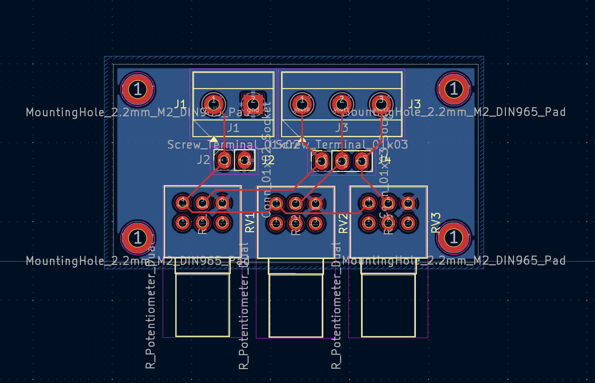

# 3 Pots PCB

Crappy "design" of "integration" board for 3 potentiometers.
female pin header and screw terminal block added for convenience.

Generic RK097 dual pot is a modification of KiCad library element; excluded from this repo license.

